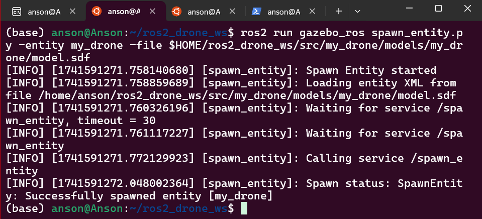

# ROS 2 Drone Navigation in Gazebo

## Overview
This project enables **drone navigation in Gazebo using ROS 2 Humble** by publishing velocity commands (`/cmd_vel`). The drone's motion is controlled by sending `geometry_msgs/Twist` messages.

  
*Illustration of the drone in Gazebo*

---

## Features
- **Velocity Command Control**: Move the drone by publishing messages to `/cmd_vel`.
- **ROS 2 Humble Integration**: Uses ROS 2 for communication and control.
- **Gazebo Simulation**: Realistic drone movement in a simulated environment.
- **Custom Drone Model & World**: Visually enhanced for better simulation experience.
- **Automated Movement (Future Scope)**: Potential for trajectory planning and obstacle avoidance.

---

## Installation

### Prerequisites
Ensure you have the following installed:
- **ROS 2 Humble**
- **Gazebo**
- **colcon** (for workspace management)

### Setup Instructions
1. **Clone this repository**
   ```sh
   git clone https://github.com/yourusername/ros2-drone-navigation.git
   cd ros2-drone-navigation
   ```
   
2. **Build the package**
   ```sh
   colcon build --packages-select drone_navigation
   ```
   
3. **Source the workspace**
   ```sh
   source install/setup.bash
   ```

---

## Usage

### 1. Launch the Gazebo Simulation
```sh
ros2 launch drone_navigation drone_gazebo.launch.py
```

### 2. Spawning the drone in gazebo environment
```sh
ros2 run gazebo_ros spawn_entity.py -entity my_drone -file $HOME/ros2_drone_ws/src/my_drone/models/my_drone/model.sdf
```
  
  
*spawning of drone*

### 2. Control the Drone with `/cmd_vel`
Instead of a keyboard, the drone is controlled by publishing velocity commands.

#### Move Up:
```sh
ros2 topic pub /cmd_vel geometry_msgs/Twist "{linear: {x: 0.0, y: 0.0, z: 1.0}, angular: {x: 0.0, y: 0.0, z: 0.0}}" -r 10
```

#### Move Forward:
```sh
ros2 topic pub /cmd_vel geometry_msgs/Twist "{linear: {x: 1.0, y: 0.0, z: 0.0}, angular: {x: 0.0, y: 0.0, z: 0.0}}" -r 10
```

#### Rotate Left:
```sh
ros2 topic pub /cmd_vel geometry_msgs/Twist "{linear: {x: 0.0, y: 0.0, z: 0.0}, angular: {x: 0.0, y: 0.0, z: 1.0}}" -r 10
```

  
*Drone responding to `/cmd_vel` messages*

---

## Architecture

The system consists of three main components:
1. **Gazebo Simulation** – Provides a physics-based environment for the drone.
2. **ROS 2 Nodes** – Handles command publishing and simulation control.
3. **Velocity Control Interface** – Uses `/cmd_vel` messages to move the drone.

---

## Future Improvements
-  **Predefined Flight Paths**
-  **Collision Avoidance**
-  **Joystick/Controller Support**

---

## License
This project is licensed under the MIT License - see the [LICENSE](LICENSE) file for details.
